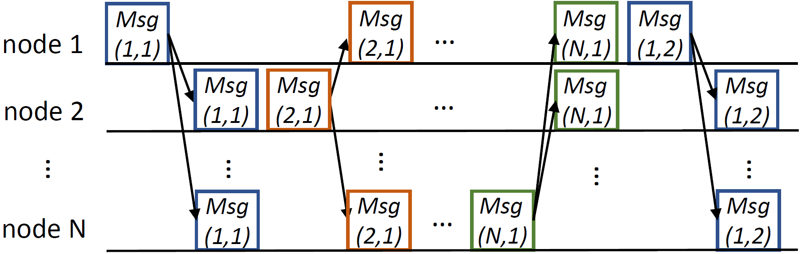

# DW_multi_node_ranging
This repository provides a protocol for efficient and fast multi-node ranging with Decawave's (Now part of Qorvo) DW1000 chips. Since the hardware is customized, you may not be able to directly clone the code and run it successfully. However, it may still help you to design your own protocol in some way.

Standard two way ranging needs three messages (POLL, RESP, FINAL) to perform ranging between two nodes. When there are multiple nodes in the environment, this protocol can be complicated. Say there are three nodes mutually perform two way ranging, Node 1 needs to send a POLL to Node 2, Node 2 sends a RESP to Node 1, Node 1 sends a FINAL to Node 2, Node 1 sends a POLL to Node 3...

Indeed, the ranging process can be much more simpler **IF THE NODE NUMER IS FIXED** and **EACH NODE HAS A UNIQUE ID**. We can use time-devision multiplexing, in which each node is allocated with a certain time slot to transmit the packet. This packet will be received by all other nodes because of the broadcasting nature of the wireless communication. Overall, the protocol is shown as follows:

This protocol is partly described in "N-way time transfer (NWTT) method for cooperative ranging". We do not specify POLL, RESP, FINAL any more. Instead, we will record the TX time for each packet sent out, and RX time for each received timestamp. This information will also be exchanged in the network so every node knows every TX and RX time for each packet in the network.

Our test shows this protocol is far more efficient than two way ranging. We test on 6 nodes which perform all-to-all ranging. The data rate is set to 110Kbps. It takes only 20-40ms to get a complete 6x6 distance matrix. The speed is expected to be faster if the data rate is set to 6.8Mpbs. As a comparison, if using original two way ranging, it will take 300ms to get a full 6x6 distance matrix.

We adopt this protocol in our paper: **ViSig: Automatic Interpretation of Visual Body Signals using On-Body Sensors**. If this protocol is helpful to you in some sense, please consider cite our paper and the aforementioned NWTT document :)

@article{NWTT,
  title={N-way time transfer (‘NWTT’) method for cooperative ranging},
  author={Green, Marilynn P},
  journal={Contribution 802.15-05-0499-00-004a to the IEEE 802.15.4a Ranging Subcommittee},
  year={2005}
}